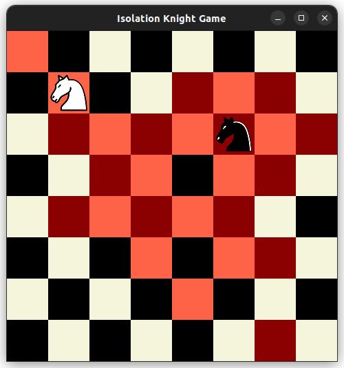

# Isolation Knight Game

## About

The Isolation Knight Game is a two-player strategy game made for the ANNT PSI 2021 project. Players control knights on an 8x8 chessboard. The objective is to move your knight in such a way that your opponent is left with no valid moves. Knights move in typical chess L-shapes, and once a square is visited, it cannot be visited again. The game ends when one of the knights cannot make a valid move. The player with the immobile knight loses. The game provides the option to play against an AI agent, making it even more challenging.


## Installation

### Prerequisites

Ensure you have `conda` installed. If not, download and install [Anaconda](https://www.anaconda.com/products/distribution) or [Miniconda](https://docs.conda.io/en/latest/miniconda.html).

### Clone the Repository

Clone the ANNT_PSI repository to your local machine:

```bash
git clone https://github.com/do3-173/ANNT_PSI.git
cd ANNT_PSI/ANNT_PSI_2021/Isolation\ Game
```

### Create and Activate a Conda Environment

Use the provided `requirements.txt` file from the `Isolation Game` folder to create a new conda environment:

```bash
conda create --name isolation_game --file requirements.txt
conda activate isolation_game
```

### Run the Game

With the environment activated, navigate to the Isolation Game directory and start the game:

```bash
python3 isolation_game.py
```

**Note:** The game uses images of knights for its GUI. These images are housed within the `figs` folder. Ensure this folder is in the same directory as `isolation_game.py` for the game to run correctly.

## Command-Line Usage

You can customize the starting positions of the knights and choose to play against an AI agent using command-line arguments:

```bash
python3 isolation_game.py --knight1 0 0 --knight2 7 6 --agent
```

In the example above, `--knight1 0 0` sets the starting position of knight1 to `(0,0)` and `--knight2 7 6` sets the starting position of knight2 to `(7,6)`. The `--agent` flag means that knight2 will be controlled by the AI agent.
