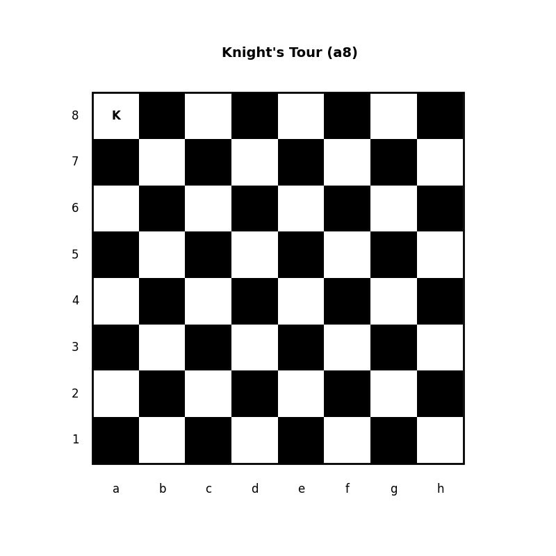

# Knight's Tour

The Knight's Tour is a classic problem in the field of computer science and mathematics. It involves moving a knight on a chessboard such that it visits every square exactly once. A knight moves in an L-shape: two squares in one direction (either horizontally or vertically) followed by one square in the perpendicular direction, or vice versa.



## Warnsdorff's Rule

The Warnsdorff's heuristic is a popular method to find a solution to the Knight's Tour. The rule involves selecting the next move based on the number of onward moves that the knight will have from the target square. Specifically, the knight moves to the square from which it will have the fewest onward moves.

This repository contains an implementation of the Knight's Tour problem using the Warnsdorff's heuristic.

## Repository Structure

- `plot_knights_tour.py`: Contains functions to visualize the knight's tour on a chessboard.
- `dfs_warnsdorffs_knights_tour.py`: Contains the implementation of the Knight's Tour using depth-first search and Warnsdorff's heuristic.
- `animations/`: Directory containing GIF animations of the knight's tours.
- `papers/`: Contains papers and literature related to the Knight's Tour and Warnsdorff's Rule.
- `solutions/`: Directory containing solutions to the Knight's Tour in `.txt` format.

### Prerequisites

Ensure you have `conda` installed. If not, download and install [Anaconda](https://www.anaconda.com/products/distribution) or [Miniconda](https://docs.conda.io/en/latest/miniconda.html).

## Installation and Setup

1. Clone the repository:
   ```
   git clone https://github.com/do3-173/ANNT_PSI.git
   cd ANNT_PSI/ANNT_PSI_2021/Knight's\ Tour/
   ```

2. It's recommended to use a virtual environment to manage dependencies. You can create one using conda:

   ```
   conda create --name knights_tour_env --file requirements.txt
   conda activate knights_tour_env
   ```

## Usage

To find a Knight's Tour at position (0,0) with board_size = 8 without visualization, run:

```
python3 dfs_warnsdorffs_knights_tour.py
```

For a customized Knight's Tour, you can provide arguments. Here's an example:

```
python3 dfs_warnsdorffs_knights_tour.py --board_size 8 --start_row 2 --start_col 5 --visualize --output_filename_animation 8x8_2-5.gif
```

This will generate a solution for a board of size `8x8` starting from row `2`, column `5` and will also create an animation GIF named `8x8_2-5.gif` showing the knight's movements on the board.
